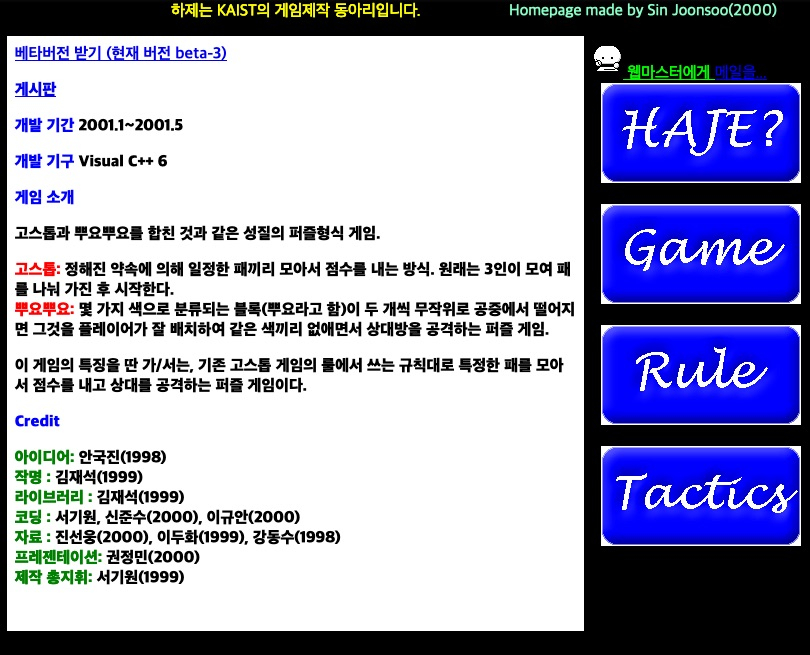

# winter-source-beta-3

Copied from https://web.archive.org/web/20020226000236/http://haje.kaist.ac.kr/product/winter/main.html

 * 날짜 : 2000-11-23/2001-05-16
 * 설명 : 퍼즐 게임
 * Platform : Win9x/ME, 2000
 * 개발 환경 : Win2000 / DirectX / Visual C++ 6.0
 * Download: https://github.com/keewon/winter-source-beta-3/releases/tag/winter-beta-3

## 게임 소개

고스톱과 뿌요뿌요를 합친 것과 같은 성질의 퍼즐형식 게임.

 * 고스톱: 정해진 약속에 의해 일정한 패끼리 모아서 점수를 내는 방식. 원래는 3인이 모여 패를 나눠 가진 후 시작한다.
 * 뿌요뿌요: 몇 가지 색으로 분류되는 블록(뿌요라고 함)이 두 개씩 무작위로 공중에서 떨어지면 그것을 플레이어가 잘 배치하여 같은 색끼리 없애면서 상대방을 공격하는 퍼즐 게임.

이 게임의 특징을 딴 가/서는, 기존 고스톱 게임의 룰에서 쓰는 규칙대로 특정한 패를 모아서 점수를 내고 상대를 공격하는 퍼즐 게임이다.

## Credit

 * 아이디어: 안국진(1998)
 * 작명 : 김재석(1999)
 * 라이브러리 : 김재석(1999)
 * 코딩 : 서기원, 신준수(2000), 이규안(2000)
 * 자료 : 진선웅(2000), 이두화(1999), 강동수(1998)
 * 프레젠테이션: 권정민(2000)
 * 제작 총지휘: 서기원(1999)

## 게임 룰

매 회마다 공중에서 화투 패가 두 장씩 무작위로 떨어진다.
플레이의 시작

*화투의 패는 모두 48가지이며, 그 외 게임마다 두는 특별한 쌍피가 보통 2장이 있다. 게임은 이 50장의 화투를 관리하며 이들을 양쪽 플레이어에 수시로 배분.수거한다.

플레이어는 이 패를 적절히 배치하여 데크에 쌓는다.

*뿌요뿌요와 같이 패를 이동 및 회전시킬 수 있다. 일정 시간마다 패는 아래로 떨어지므로 게임은 신속한 판단을 요구한다.

패가 데크에 쌓아지면 데크는 쌓인 패 중 서로 접한 패끼리 '점수'가 나는 경우가 있는지를 검사한다.

점수가 발생하면 그 점수만큼의 10배를 스코어에 더한다.

접한 패끼리 3점 이상의 점수가 나면 그 패들은 없어지며, 상대에게 그 점수만큼의 공격이 들어간다.

혹은 의 과정 직후 또 다시 점수가 발생하면 해당 패들이 없어지며 '고'가 선언되어 새로운 점수 및 '고'가 선언된 횟수만큼 상대에게 공격이 들어간다.

공격이다!

*'어떤 점수만큼' 공격이 들어간다는 것은, 게임에 그만큼의 점수를 자신이 냈음을 알리면서 상대 플레이어에게 그만큼의 '벌칙'을 내려달라는 요청을 하는 것이다. 그러나 그 요청이 받아들여지기 전에 상대 역시 같이 공격을 했다면 자신이 모두 누적된 점수의 벌칙을 뒤집 어쓰는 경우도 있다.

*그 '벌칙'이란 '얼음패'로 통칭되는 방해 패가 그 점수만큼 떨어져 상대의 데크에 여유를 없애면서 패 사이의 연결을 끊게 하는 것이다.

망했다...ㅠㅠ

'얼음패'는 그 주위의 패가 5나 6의 과정으로 인해 없어질 때 함께 소멸한다.

공격할 때는 공격 포인트의 100배를 스코어에 더한다.

'고'가 선언되면 현재 '고'의 선언 횟수의 50배를 스코어에 더한다.

게임 관리자가 내줄 패가 더 이상 없을 때에는 점수가 높은 쪽이 승자가 된다.

어느 한쪽의 데크에 쌓인 패가 꼭대기까지 차 오르면 그 플레이어의 패배가 된다.

지원하는 플레이 모드

1. 1인 플레이
2. 키보드로 2인 대전
3. 컴퓨터 플레이어와 대전
4. 네트워크 대전 ~(준비중)~

## 게임 전략

이 게임을 만들고 시험해 보는 동안 가/서 스탭들은 게임할 때 쓸 수 있는 몇 가지 전략을 생각해 내었다.

### 같은 종류의 패끼리는 같은 열에.

이 게임에서는 점수를 낼 수 있는 패의 짝이 많기 때문에 한 번 갇혀버린 패를 밖으로 꺼내기가 쉽지 않다. 그래서 같은 종류의 패들끼리는 금방금방 닿아서 점수를 낼 수 있도록 각 열마다 같은 종류의 패를 놓는 것이 좋다. 보통 수가 많은 '피'를 가운데에 두 열 정도, 광을 구석 한 열, 띠를 구석 한 열, 그림을 피 옆 한 열에 놓는 것을 권장한다. (그림을 피 옆에 배치시키는 이유는 그림으로도, 쌍피로도 작용할 수 있는 패가 존재하기 때문이다.)

### 두 열 사이에 패를 교차시킨다.
보통 1.의 전략을 충실히 이행하는 것이 좋지만 그것이 힘들 경우, 세 열 정도를 두 가지 패가 차지하도록 하여 연결이 끊기지 않도록 주의하는 것이 좋다.
띠와 피를 교차시키자

### 소수의 패로 큰 점수를 낼 수 있는 패들(광, 고도리 등)은 되도록 묻히지 않게 한다.
광이나 고도리, 홍단, 청단 등은 전체를 통틀어 얼마 있지 않은 패이다. 운이 좋아 이들이 자주 나올 경우 큰 점수를 기대할 수 있다.
4광 찬스!

### 연타 작전
'뿌요뿌요'에서 주력이 되는 전략으로 이 게임에서는 '고'의 역할이다. 어떤 패가 없어진 직후에 다시 다른 패들이 없어지게 하는 전략. 이것은 점수가 날 만한 패의 모임 위아래에 적절한 패를 배치시켜 놓는 것으로 가능하다. 단 자주 쓰기는 힘들다. 3고의 경우 (세번 연속 점수) 점수가 두배가 된다.

### 독박 작전
고난도의 작전으로, 언제든지 점수를 낼 수 있는 배치를 하나 만든 후 기다리고 있다가 상대편이 점수를 낸 직후에 그 배치로 점수를 완성시켜, 상대가 보낸 점수에 얹어서 되돌려 주는 작전이다. 주된 작전은 되지 못하지만 안전성 확보라는 측면에서 종종 쓰인다.

---
가/서 (c) 2001 HAJE All Rights Reserved
